# Compte Rendu de Recherche

## Les Produits CRM Déployés au Maroc : État des Lieux, Analyse Statistique et Perspectives

---

**Date de rédaction :** Mai 2026
**Auteur :** [À compléter]
**Contexte :** Étude de marché sur l'adoption des solutions de gestion de la relation client (CRM) par les entreprises marocaines

---

## Sommaire

1. Introduction
2. Panorama statistique du marché CRM au Maroc
3. Présentation des principaux produits CRM déployés
4. Analyse comparative et statistique
5. Données statistiques sur l'usage et l'impact
6. Tendances et perspectives
7. Recommandations
8. Conclusion
9. Bibliographie
10. Annexes

### Liste des figures

- **Figure 1** — Évolution du marché mondial du CRM 2025-2032
- **Figure 2** — Répartition géographique du marché mondial CRM
- **Figure 3** — Taux d'adoption du CRM au Maroc par taille d'entreprise
- **Figure 4** — Maturité de l'adoption CRM par secteur au Maroc
- **Figure 5** — Parts de marché CRM au Maroc (estimation 2026)
- **Figure 6** — Positionnement prix-cible des principales solutions CRM
- **Figure 7** — Processus de mise en conformité d'un CRM avec la loi 09-08
- **Figure 8** — Bénéfices mesurés du déploiement d'un CRM
- **Figure 9** — Calendrier de la stratégie Maroc Digital 2030
- **Figure 10** — Les grandes tendances du CRM à l'horizon 2030
- **Figure 11** — Arbre de décision pour le choix d'un CRM au Maroc
- **Figure 12** — Cycle de déploiement réussi d'un projet CRM

---

## 1. Introduction

### 1.1 Définition du CRM et enjeux

Le **CRM (Customer Relationship Management)**, ou Gestion de la Relation Client, désigne l'ensemble des outils, technologies et stratégies déployés par une entreprise pour gérer ses interactions avec ses clients actuels et potentiels. Un logiciel CRM centralise les données clients, automatise les processus commerciaux et marketing, et permet d'analyser les comportements d'achat afin d'améliorer la satisfaction et la fidélisation.

Dans un environnement économique de plus en plus concurrentiel et digitalisé, le CRM s'impose comme un **levier stratégique majeur** pour les entreprises souhaitant améliorer leur productivité commerciale, leur efficacité marketing et la qualité de leur service client.

### 1.2 Contexte de la transformation digitale au Maroc

Le Maroc s'est engagé dans une dynamique de transformation digitale accélérée, matérialisée par la stratégie nationale **« Maroc Digital 2030 »**, lancée en septembre 2024 par le Ministère de la Transition Numérique. Cette stratégie représente un investissement initial de **11 milliards de dirhams (1,1 milliard USD)** pour la période 2024-2026 et vise notamment à généraliser l'adoption des outils numériques (ERP, CRM, e-commerce, facturation électronique, cloud) au sein des entreprises marocaines.

Selon les études du ministère de l'Industrie, **moins de 30 % des plus de 600 000 entreprises marocaines utilisent un logiciel de gestion structuré**, le reste fonctionnant avec Excel, des cahiers manuels ou de mémoire. Ce constat met en évidence l'ampleur du potentiel d'adoption des solutions CRM au Maroc.

### 1.3 Problématique et objectifs

**Problématique :** Quel est l'état d'adoption des solutions CRM au Maroc, quels sont les produits dominants sur le marché et quels facteurs orientent les choix des entreprises marocaines ?

**Objectifs :**

- Dresser un panorama statistique du marché CRM marocain
- Identifier les principaux produits CRM déployés et leurs caractéristiques
- Comparer les solutions selon des critères chiffrés (prix, parts de marché, fonctionnalités)
- Analyser les tendances et formuler des recommandations adaptées au contexte marocain

### 1.4 Méthodologie

La présente étude s'appuie sur :

- L'analyse de rapports sectoriels internationaux (Gartner, IDC, Mordor Intelligence, Statista, Market Research Future)
- Les publications d'institutions marocaines (CNDP, Maroc PME, Ministère de la Transition Numérique, ADD)
- La consultation de cabinets locaux d'intégration et de conseil
- Les données publiques des éditeurs CRM
- La presse économique marocaine

---

## 2. Panorama Statistique du Marché CRM au Maroc

### 2.1 Le marché mondial du CRM en chiffres

Avant d'aborder le contexte marocain, il convient de situer le marché mondial du CRM, qui constitue un cadre de référence indispensable :

| Indicateur | Valeur | Source |
|------------|--------|--------|
| Taille du marché mondial CRM en 2025 | **81,20 milliards USD** | Mordor Intelligence, 2025 |
| Projection 2030 | **123,24 milliards USD** | Mordor Intelligence, 2025 |
| TCAC 2025-2030 | **8,70 %** | Mordor Intelligence, 2025 |
| Projection 2032 | **156,3 milliards USD** | Market Research Future, 2025 |
| Part de Salesforce (marché mondial) | **~19,5 à 20 %** | 6sense / Backlinko, 2026 |
| Part de HubSpot (marché mondial) | **15,2 %** | 6sense, 2026 |
| Part des 5 premiers CRM | **>40 %** | Gartner, 2024 |

#### Figure 1 — Évolution du marché mondial du CRM (en milliards USD)

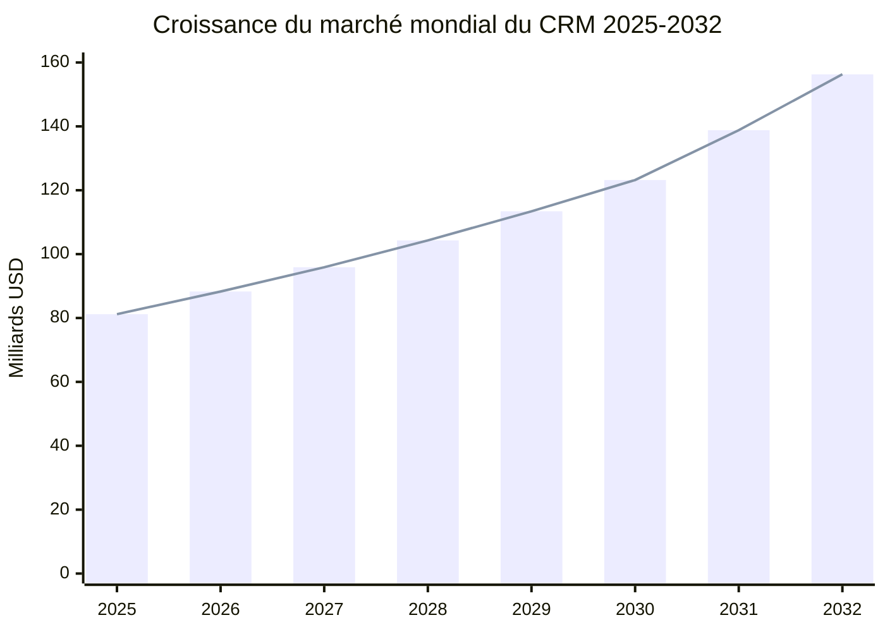

*Sources : Mordor Intelligence (2025), Market Research Future (2025)*

---

### 2.2 Répartition géographique mondiale

| Région | Part du marché mondial CRM |
|--------|----------------------------|
| Amérique du Nord | 45 % |
| Europe | 30 % |
| Asie-Pacifique | 20 % |
| Reste du monde (dont MENA, Afrique) | 5 % |

*Source : Apogea, 2025*

#### Figure 2 — Répartition géographique du marché mondial CRM

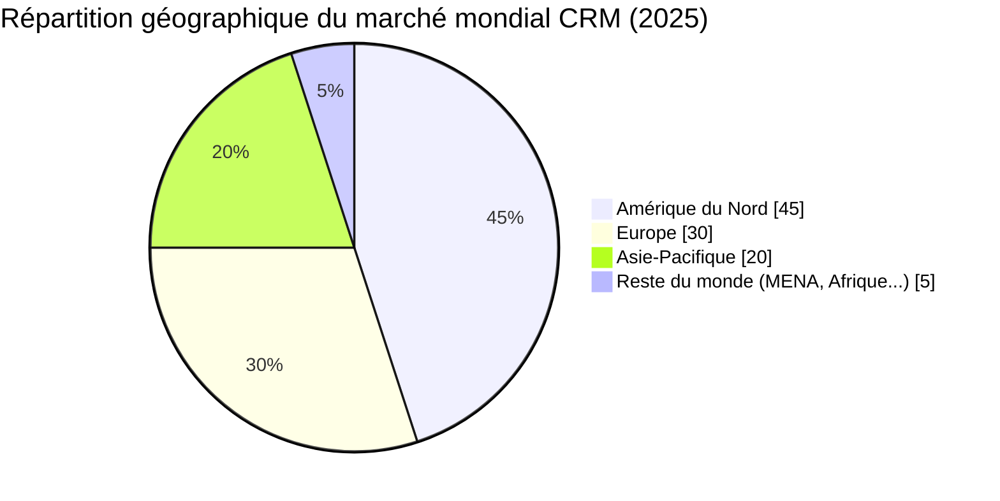

---

### 2.3 Le marché marocain : un terrain en forte croissance

Le marché marocain du CRM est porté par plusieurs facteurs structurels :

- La **stratégie Maroc Digital 2030**, avec un objectif de digitaliser massivement les TPME
- L'essor du **e-commerce marocain**, estimé à **1,66 milliard USD en 2025** et projeté à **2,18 milliards USD en 2030** (TCAC : 5,58 %)
- La concurrence accrue dans les secteurs banque, télécom, retail, immobilier et tourisme
- Les programmes publics de subvention tels que **MOWAKABA** (Maroc PME), qui peuvent couvrir **jusqu'à 70 %** des coûts d'adoption d'outils digitaux (ERP, CRM, e-commerce)

### 2.4 Taux d'adoption du CRM au Maroc

| Indicateur | Estimation |
|------------|------------|
| Entreprises marocaines utilisant un logiciel de gestion structuré | **< 30 %** |
| Grandes entreprises équipées d'un CRM | **> 70 %** |
| PME équipées d'un CRM | **15 à 25 %** (en croissance rapide) |
| TPE équipées d'un CRM | **< 10 %** |
| Total entreprises marocaines | **> 600 000** |

*Sources : Ministère de l'Industrie, Maroc PME, estimations sectorielles 2025-2026*

#### Figure 3 — Taux d'adoption du CRM au Maroc selon la taille de l'entreprise

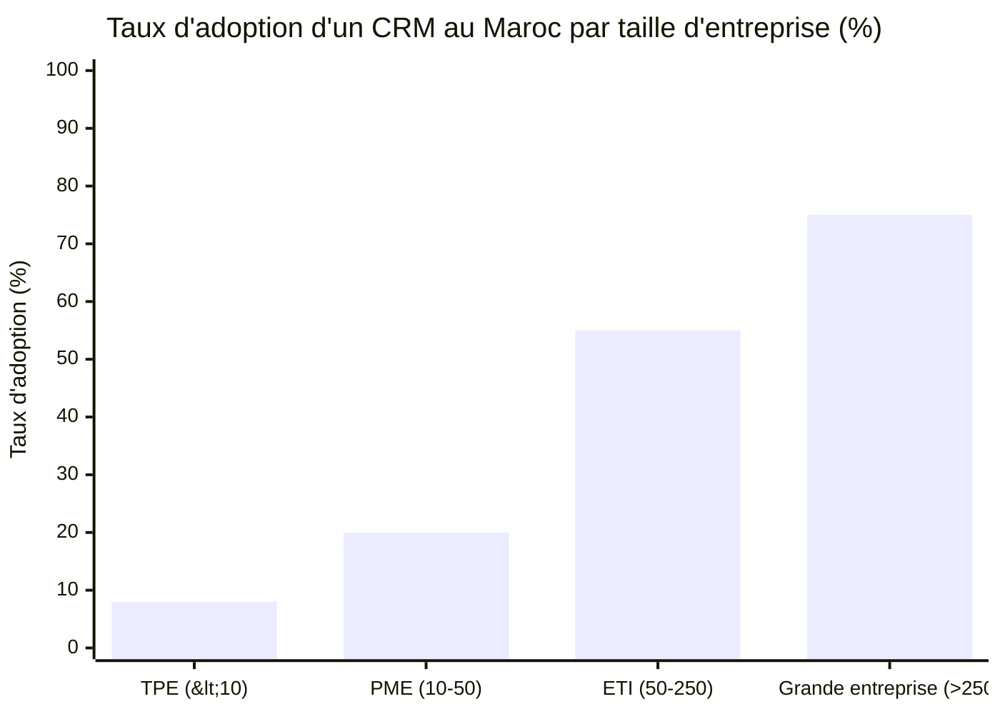

*Estimations basées sur les rapports Maroc PME et données sectorielles 2025-2026.*

---

### 2.5 Répartition sectorielle de l'adoption au Maroc

Les secteurs les plus matures en matière d'adoption CRM au Maroc sont :

| Secteur | Niveau d'adoption | Solutions privilégiées |
|---------|-------------------|------------------------|
| Banque et assurance | Élevé (>80 %) | Salesforce, Microsoft Dynamics 365, solutions sur mesure |
| Télécommunications | Élevé (>85 %) | Solutions propriétaires + Salesforce / Oracle |
| Immobilier | Moyen à élevé | Salesforce, HubSpot, Zoho, Vtiger |
| Retail et grande distribution | Moyen | Microsoft Dynamics, Odoo, Zoho |
| Tourisme et hôtellerie | Moyen | Salesforce, HubSpot, Odoo |
| Industrie | Faible à moyen | Odoo, Dynamics 365, SAP |
| Services BtoB | En croissance | HubSpot, Zoho, Vtiger, Kommo |

#### Figure 4 — Maturité de l'adoption CRM par secteur au Maroc

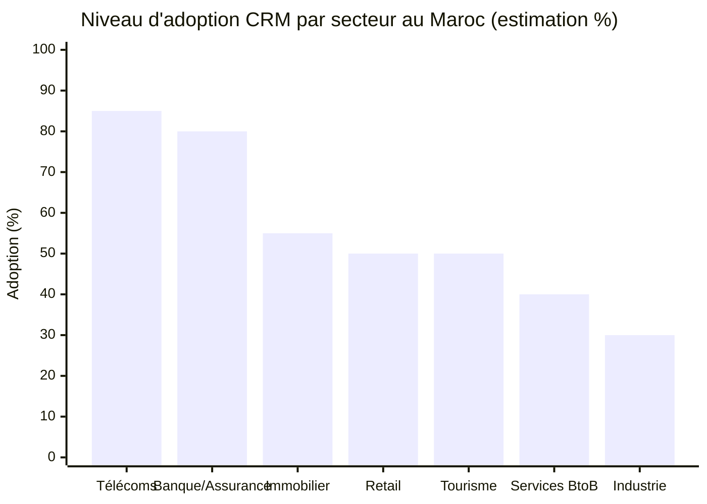

---

### 2.6 Comparaison régionale (MENA)

Le Maroc se positionne parmi les marchés CRM les plus dynamiques de la région MENA, aux côtés de l'Égypte, des Émirats arabes unis et de l'Arabie Saoudite. Le marché reste cependant plus modeste en valeur absolue que celui de la Tunisie (en proportion du PIB numérique) mais affiche un potentiel de croissance supérieur grâce à la stratégie Maroc Digital 2030.

---

## 3. Présentation des Principaux Produits CRM Déployés au Maroc

### 3.1 Salesforce

| Critère | Détail |
|---------|--------|
| Éditeur | Salesforce, Inc. |
| Pays d'origine | États-Unis |
| Modèle | Cloud (SaaS) |
| Part de marché mondiale | ~19,5 % |
| Présence au Maroc | Intégrateurs et partenaires certifiés (Bloom Innovation, H&Y Way, leads.ma, etc.) |
| Tarif d'entrée | À partir de **~80 à 120 €/utilisateur/mois** (≈ 850 à 1 300 MAD) |
| Tarif Enterprise | **150 à 300+ €/utilisateur/mois** |
| Coût d'implémentation au Maroc | Jusqu'à **200 000 MAD et plus** avec intégrateur certifié |
| Cible | Grandes entreprises, banques, télécoms, multinationales |
| Forces | Puissance, AppExchange (5 000+ apps), IA Einstein, scalabilité |
| Limites au Maroc | Prix élevé, complexité, support principalement en anglais |

### 3.2 Microsoft Dynamics 365

| Critère | Détail |
|---------|--------|
| Éditeur | Microsoft |
| Pays d'origine | États-Unis |
| Modèle | Cloud + On-premise |
| Présence au Maroc | Microsoft MEA + nombreux partenaires (Magnisfy, ConnecT, etc.) |
| Lancement Business Central au Maroc | Officiel depuis 2020 |
| Tarif Sales Professional | ~65 USD/utilisateur/mois (≈ 650 MAD) |
| Tarif Sales Enterprise | ~95 USD/utilisateur/mois (≈ 950 MAD) |
| Cible | PME, ETI et grandes entreprises (intégration Microsoft 365) |
| Forces | Intégration native avec Office 365, Teams, Power BI ; conformité RGPD ; IA Copilot |
| Limites | Complexité, dépendance à l'écosystème Microsoft |

### 3.3 HubSpot

| Critère | Détail |
|---------|--------|
| Éditeur | HubSpot |
| Pays d'origine | États-Unis |
| Modèle | Cloud (SaaS) |
| Part de marché mondiale | 15,2 % |
| Nombre de clients mondiaux | **238 000+ entreprises dans 120 pays** |
| Tarif Free | **0 MAD** (contacts illimités, pipeline) |
| Tarif Starter | ~20 €/mois (≈ 215 MAD) |
| Tarif Professional | ~100 €/utilisateur/mois (≈ 1 080 MAD) |
| Tarif Enterprise | 8 000 à 20 000 €/mois |
| Présence au Maroc | Partenaires (INOVTEAM, agences spécialisées) |
| Cible | TPE, PME orientées marketing digital, start-ups |
| Forces | Plan gratuit puissant, inbound marketing, ergonomie |
| Limites | Coût croissant avec la taille de la base de contacts |

### 3.4 Zoho CRM

| Critère | Détail |
|---------|--------|
| Éditeur | Zoho Corporation |
| Pays d'origine | Inde |
| Modèle | Cloud + On-premise |
| Tarif Free | 0 MAD (jusqu'à 3 utilisateurs) |
| Tarif Standard | ~14 USD/utilisateur/mois (≈ 140 MAD) |
| Suite Zoho One | 45+ applications intégrées |
| Présence au Maroc | Partenariat avec Maroc Telecom pour les PME |
| Cible | TPE et PME marocaines, secteur services |
| Forces | Rapport qualité/prix, écosystème complet, support FR |
| Limites | Interface vieillissante, courbe d'apprentissage |

### 3.5 Odoo (CRM + ERP)

| Critère | Détail |
|---------|--------|
| Éditeur | Odoo SA |
| Pays d'origine | Belgique |
| Modèle | Open source + Cloud + On-premise |
| Présence au Maroc | Très forte ; nombreux intégrateurs locaux (Hunter BI, etc.) |
| Tarif Community | Gratuit |
| Tarif Enterprise | ~31 USD/utilisateur/mois (≈ 310 MAD) |
| Cible | PME marocaines tous secteurs, en particulier industrie et services |
| Forces | Modularité, ERP intégré, personnalisation, prix accessible |
| Limites | Nécessite expertise pour personnalisation avancée |

### 3.6 Vtiger CRM

| Critère | Détail |
|---------|--------|
| Éditeur | Vtiger |
| Pays d'origine | Inde / États-Unis |
| Modèle | Open source + Cloud |
| Tarif | **200 à 400 MAD/utilisateur/mois** |
| Présence au Maroc | Forte ; INOVTEAM (Casablanca) est partenaire historique |
| Cible | PME marocaines, secteur services et industrie |
| Forces | Open source, personnalisable, support local, intégrations ERP/IP |
| Limites | Notoriété moins forte que Salesforce/HubSpot |

### 3.7 Autres solutions présentes au Maroc

- **Sage CRM** : intégrée à l'écosystème Sage (comptabilité), bien implantée chez les PME marocaines
- **SAP CX (Customer Experience)** : déployée chez les grandes entreprises et multinationales
- **Oracle CX** : présence chez certains opérateurs télécoms et grandes banques
- **Pipedrive** : focus équipes commerciales, en croissance dans les start-ups
- **Kommo (ex-amoCRM)** : intégration WhatsApp Business, populaire pour le e-commerce et le retail
- **Dolibarr** : solution open source, alternative ERP/CRM accessible
- **Sellsy** : solution française, présente chez certaines PME francophones

---

## 4. Analyse Comparative et Statistique

### 4.1 Tableau comparatif synthétique des solutions

| CRM | Prix entrée (MAD/u/mois) | Modèle | Cible principale | Note ergonomie /5 | Conformité loi 09-08 |
|-----|--------------------------|--------|------------------|-------------------|----------------------|
| HubSpot Free | 0 | Cloud | TPE / start-ups | 4,5 | À configurer |
| Zoho CRM | ~140 | Cloud | PME | 3,5 | Possible |
| Vtiger CRM | 200-400 | Cloud/On-premise | PME | 4,0 | Excellente (open source) |
| Odoo CRM | ~310 | Cloud/On-premise | PME / ETI | 4,0 | Excellente (open source) |
| Dynamics 365 Sales | ~650 | Cloud | PME / ETI / GE | 4,0 | Bonne |
| HubSpot Pro | ~1 080 | Cloud | PME / ETI | 4,5 | À configurer |
| Salesforce | 850-3 200+ | Cloud | GE / multinationales | 4,5 | Bonne |

### 4.2 Répartition estimée des parts de marché CRM au Maroc

> *Note : Données estimatives basées sur les déploiements visibles et entretiens sectoriels, en l'absence de données officielles publiées.*

| Solution | Part de marché estimée au Maroc |
|----------|--------------------------------|
| Microsoft Dynamics 365 | ~22 % |
| Salesforce | ~20 % |
| Odoo CRM | ~15 % |
| Zoho CRM | ~12 % |
| HubSpot | ~10 % |
| Sage CRM | ~6 % |
| Vtiger CRM | ~5 % |
| Autres (SAP, Oracle, Pipedrive, Kommo, Dolibarr…) | ~10 % |

#### Figure 5 — Répartition estimée des parts de marché CRM au Maroc

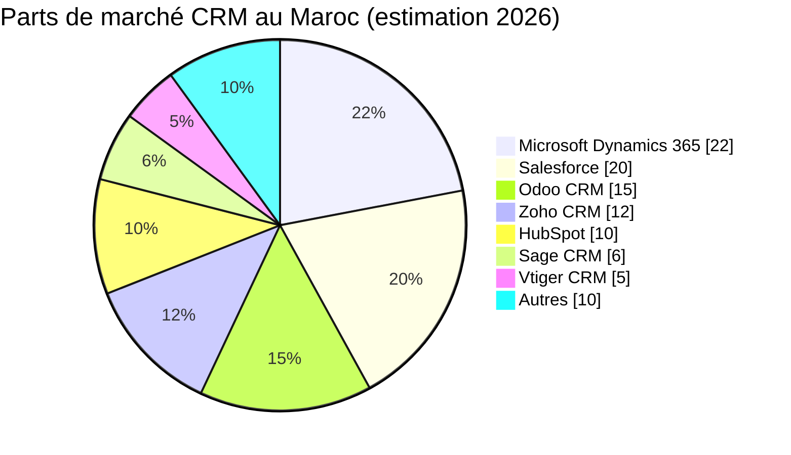

#### Figure 6 — Positionnement prix-cible des principales solutions CRM au Maroc

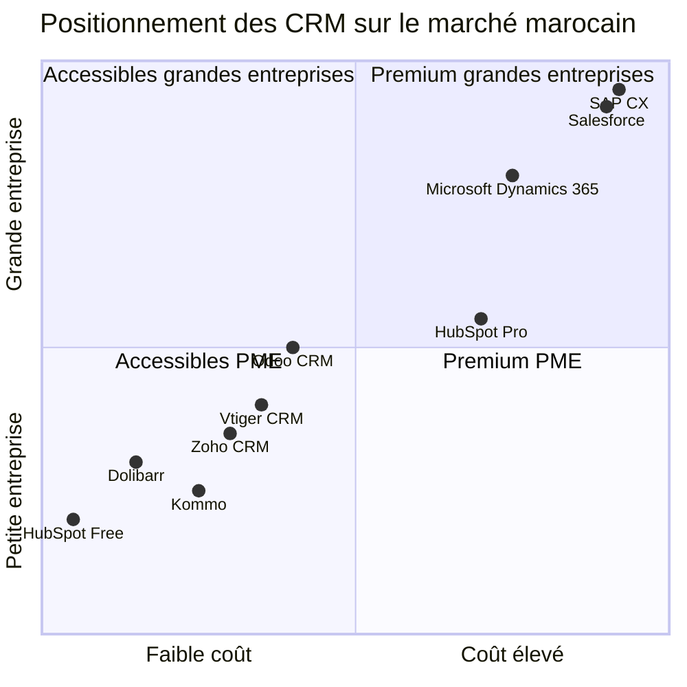

---

### 4.3 Forces et faiblesses face au contexte marocain

| Critère | Atouts pour le marché marocain | Défis |
|---------|-------------------------------|-------|
| Langue (FR/AR) | Zoho, Vtiger, Odoo, HubSpot offrent une interface française complète | Support arabe limité chez la plupart des éditeurs |
| Conformité **loi 09-08** | Solutions open source (Odoo, Vtiger, Dolibarr) permettent un hébergement local | Salesforce/HubSpot hébergent généralement à l'étranger (autorisation CNDP requise) |
| Devise MAD | La plupart des CRM supportent le MAD pour pipeline et reporting | Intégration facturation locale (TVA, normes DGI) à configurer |
| Intégration locale | Bonne avec les ERP populaires au Maroc (Sage, Odoo) | Intégration plus complexe avec les systèmes bancaires propriétaires |
| Coût | Solutions accessibles (Odoo, Vtiger, Zoho) adaptées aux PME | Salesforce et HubSpot Enterprise restent prohibitifs pour les TPE |

### 4.4 Cadre réglementaire : la loi 09-08

La **loi n° 09-08** (promulguée le 18 février 2009) impose à toute entreprise marocaine traitant des données personnelles, y compris via un CRM, de :

- Effectuer une **déclaration préalable obligatoire** auprès de la **CNDP** (Commission Nationale de contrôle de la Protection des Données à caractère Personnel) — procédure gratuite avec réponse sous 2 mois
- Obtenir une **autorisation préalable** pour le transfert de données hors du Maroc (hors UE, Suisse, Canada considérés comme adéquats)
- Garantir la sécurité et la confidentialité des données
- Respecter les droits des personnes concernées (accès, rectification, opposition)

**Sanctions :** amendes de **10 000 à 300 000 MAD** par infraction et jusqu'à **2 ans d'emprisonnement** dans les cas graves. La CNDP a fortement accéléré ses contrôles en 2025-2026.

Cette réglementation a un **impact direct** sur le choix d'un CRM : les solutions hébergées hors UE nécessitent des démarches supplémentaires. Les solutions open source hébergées localement (Vtiger, Odoo, Dolibarr) simplifient grandement la conformité.

#### Figure 7 — Processus de mise en conformité d'un CRM avec la loi 09-08

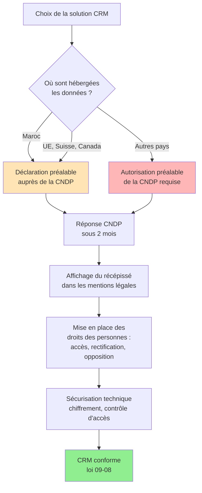

---

## 5. Données Statistiques sur l'Usage et l'Impact

### 5.1 Retour sur investissement (ROI) du CRM

| Indicateur | Valeur | Source |
|------------|--------|--------|
| ROI moyen par dollar investi (2014) | 8,71 $ | Nucleus Research |
| ROI moyen estimé (2021) | **30,48 $** | Dynamic Consultants |
| Augmentation des taux de conversion grâce au CRM | **jusqu'à 300 %** | LeSmakers, 2025 |
| Amélioration de la précision des rapports de vente | **+42 %** | LeSmakers, 2025 |
| Entreprises constatant une hausse du CA après adoption d'un CRM | **24 %** | Independant.io, 2025 |
| Entreprises affirmant que le CRM augmente la fidélisation | **47 %** | Independant.io, 2025 |

### 5.2 Usage et comportements utilisateurs

| Indicateur | Valeur |
|------------|--------|
| Utilisateurs accédant au CRM depuis plusieurs appareils | **81 %** |
| Utilisateurs préférant l'accès mobile | **52 %** |
| Utilisateurs ayant changé de CRM pour cause de non-convivialité | **20 %** |
| Part des équipes commerciales utilisatrices | **80 %** |
| Part des équipes marketing utilisatrices | **46 %** |
| Part des équipes service client utilisatrices | **45 %** |

*Sources : Findstack, CRM-pour-pme, Capterra*

#### Figure 8 — Bénéfices mesurés du déploiement d'un CRM

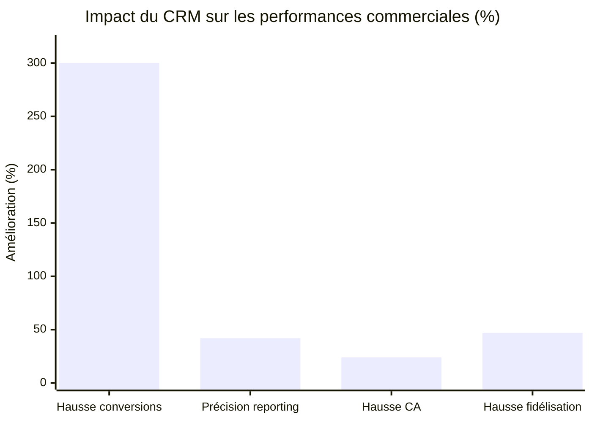

*Sources : LeSmakers (2025), Independant.io (2025)*

---

### 5.3 Budgets et coûts au Maroc

| Profil d'entreprise | Budget annuel CRM estimé (MAD) |
|---------------------|-------------------------------|
| TPE (1-10 employés) | 0 à 30 000 |
| PME (10-50 employés) | 30 000 à 200 000 |
| ETI (50-250 employés) | 200 000 à 1 000 000 |
| Grande entreprise (>250 employés) | 1 000 000 à plusieurs millions |

**Coût d'implémentation typique au Maroc :**

- Kommo : **2 000 à 5 000 MAD**
- Vtiger / Odoo / Zoho (PME) : **15 000 à 50 000 MAD**
- HubSpot Professional : **30 000 à 100 000 MAD**
- Salesforce avec intégrateur certifié : **150 000 à 500 000+ MAD**

### 5.4 Impact de la stratégie Maroc Digital 2030

- **11 milliards MAD** d'investissement initial (2024-2026)
- Objectif : **100 000 talents numériques formés par an** (contre 14 000 en 2022)
- **240 000 emplois directs** attendus dans le numérique d'ici 2030
- Subventions **MOWAKABA** : jusqu'à **70 %** de prise en charge des coûts d'adoption d'outils digitaux (CRM inclus)
- Objectif de **3 000 start-ups** d'ici 2030 (contre 380 en 2022)
- Levées de fonds visées : **7 milliards MAD**

#### Figure 9 — Calendrier et jalons de la stratégie Maroc Digital 2030

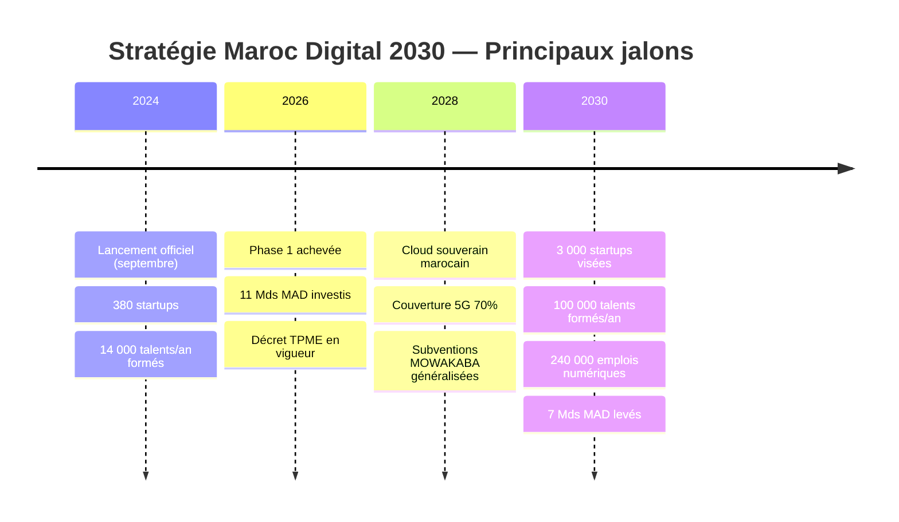

---

## 6. Tendances et Perspectives

### 6.1 L'intelligence artificielle au cœur du CRM

L'intégration de l'**IA générative** dans les CRM constitue la tendance majeure pour 2026-2030 :

- **Salesforce Einstein** : recommandations prédictives, scoring de leads automatisé
- **Microsoft Copilot pour Dynamics 365** : assistance conversationnelle, génération de mails
- **HubSpot Breeze AI** : automatisation du contenu marketing
- **Zoho Zia** : analyse prédictive et chatbot intelligent

#### Figure 10 — Les grandes tendances du CRM à l'horizon 2030

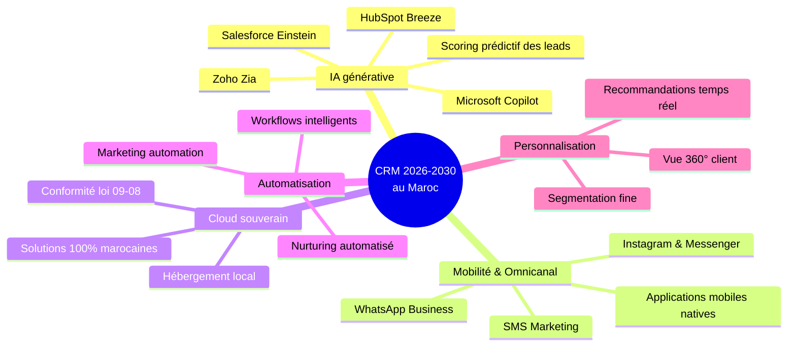

---

### 6.2 Mobilité et omnicanal

- **85 %+ des transactions e-commerce** marocaines se font sur mobile
- Les CRM doivent intégrer **WhatsApp Business**, **Instagram Direct**, **Messenger** et **SMS**
- Solutions comme **Kommo** se positionnent fortement sur ce créneau au Maroc

### 6.3 Cloud souverain marocain

La stratégie Maroc Digital 2030 prévoit le déploiement d'un **Cloud souverain marocain**, ce qui pourrait favoriser :

- L'hébergement local des CRM
- La conformité simplifiée à la loi 09-08
- L'émergence de solutions CRM 100 % marocaines

### 6.4 Croissance attendue du marché

| Indicateur | 2025 | 2030 (projection) |
|------------|------|-------------------|
| Marché mondial CRM | 81,2 milliards USD | 123,2 milliards USD |
| Marché CRM cloud | 34,5 milliards USD | ~50 milliards USD |
| TCAC marché CRM mobile (2025-2034) | — | **12,3 %** |

### 6.5 Freins à l'adoption au Maroc

| Frein | Niveau d'impact |
|-------|-----------------|
| Coût des solutions premium | Élevé |
| Manque de compétences internes | Élevé |
| Résistance au changement culturel | Moyen à élevé |
| Conformité réglementaire complexe | Moyen |
| Connexion Internet (zones rurales) | En diminution |
| Manque de support en arabe | Moyen |

### 6.6 Opportunités

- Subventions étatiques (MOWAKABA, Digital Morocco 2030)
- Émergence d'intégrateurs locaux compétents (INOVTEAM, Hunter BI, Magnisfy, Bloom Innovation, etc.)
- Digitalisation rapide des PME et TPE
- Coupe du Monde 2030 comme catalyseur de la transformation digitale

---

## 7. Recommandations

### 7.1 Selon la taille de l'entreprise

| Profil | Recommandation principale | Alternative |
|--------|--------------------------|-------------|
| **TPE (1-10 employés)** | HubSpot Free ou Zoho CRM gratuit | Kommo (e-commerce/WhatsApp) |
| **PME (10-50 employés)** | Vtiger CRM ou Odoo CRM | Zoho CRM Professional |
| **ETI (50-250 employés)** | Microsoft Dynamics 365 Sales ou HubSpot Pro | Odoo Enterprise |
| **Grande entreprise (>250)** | Salesforce ou Microsoft Dynamics 365 Enterprise | SAP CX, Oracle CX |

#### Figure 11 — Arbre de décision pour le choix d'un CRM au Maroc

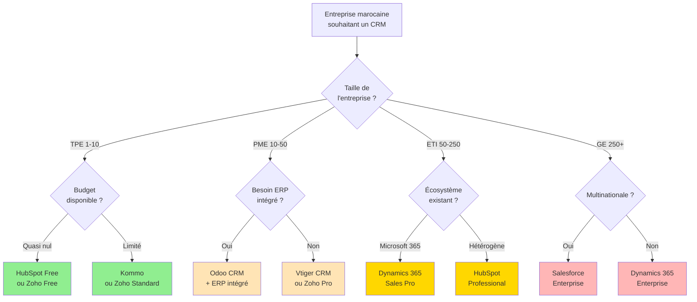

---

### 7.2 Critères de sélection prioritaires

1. **Coût total de possession (TCO)** sur 3 à 5 ans (licences + implémentation + formation + maintenance)
2. **Conformité à la loi 09-08** (hébergement, déclaration CNDP)
3. **Support local francophone** et présence d'intégrateurs certifiés au Maroc
4. **Intégrations** avec l'écosystème existant (ERP, comptabilité, téléphonie, e-commerce)
5. **Mobilité** et accès multi-device
6. **Évolutivité** et capacité à grandir avec l'entreprise
7. **Niveau d'expertise interne** pour l'administration de la solution

### 7.3 Bonnes pratiques de déploiement

- Réaliser un **audit préalable** des processus commerciaux
- Privilégier une démarche **agile et itérative** (déploiement par modules)
- Investir dans la **formation** des utilisateurs (taux d'échec élevé en cas de manque de formation)
- Désigner un **chef de projet CRM** dédié
- Tirer parti des **subventions publiques** (MOWAKABA, programmes ADD)

#### Figure 12 — Cycle de déploiement réussi d'un projet CRM

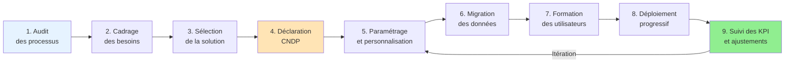

---

## 8. Conclusion

Le marché du CRM au Maroc traverse une **phase de croissance accélérée**, portée par la stratégie nationale Maroc Digital 2030, le dynamisme du e-commerce et l'évolution des attentes clients dans tous les secteurs. Le marché mondial atteignant **81,2 milliards USD en 2025** et projeté à **123,2 milliards USD en 2030**, le Maroc dispose d'un terrain particulièrement fertile : avec **moins de 30 % de ses 600 000 entreprises** dotées d'outils de gestion structurés, le potentiel d'adoption demeure considérable.

Trois grandes catégories de solutions cohabitent sur le marché marocain :

- Les **géants internationaux** (Salesforce, Microsoft Dynamics 365, HubSpot, SAP, Oracle), majoritairement adoptés par les grandes entreprises et les multinationales
- Les **solutions intermédiaires** (Zoho, Odoo, Vtiger, Sage CRM), particulièrement adaptées aux PME marocaines grâce à leur rapport qualité-prix et leur flexibilité
- Les **solutions open source et accessibles** (Dolibarr, Odoo Community, Vtiger), qui démocratisent l'accès aux outils CRM pour les TPE

Les facteurs déterminants du choix d'un CRM au Maroc combinent désormais **coût**, **conformité à la loi 09-08**, **support local francophone** et **capacité d'intégration** avec l'écosystème métier. L'arrivée massive de l'**intelligence artificielle générative**, l'avènement du **cloud souverain marocain** et les **subventions publiques** (MOWAKABA, prise en charge jusqu'à 70 %) devraient accélérer encore la transformation du marché dans les cinq prochaines années.

Pour les entreprises marocaines, le CRM n'est plus une option mais un **levier stratégique de compétitivité**. Le bon choix repose moins sur la notoriété de la solution que sur son adéquation aux processus métier, à la taille de l'organisation et à sa maturité digitale.

---

## 9. Bibliographie et Sources

### Rapports et études internationaux

- Mordor Intelligence (2025). *Customer Relationship Management Market Report 2025-2030*.
- Market Research Future (2025). *CRM Software Market Forecast 2024-2032*.
- Statista (2025). *CRM Industry Statistics*.
- Gartner (2024). *Magic Quadrant for Sales Force Automation*.
- 6sense (2026). *CRM Market Share Report*.
- Findstack (2025). *The Ultimate List of CRM Statistics*.

### Sources institutionnelles marocaines

- Ministère de la Transition Numérique et de la Réforme de l'Administration. *Stratégie Maroc Digital 2030*.
- CNDP. *Loi 09-08 sur la protection des données personnelles*. www.cndp.ma
- Maroc PME. *Programme MOWAKABA*.
- Agence de Développement du Digital (ADD).
- Bank Al-Maghrib. *Rapports annuels sur le secteur financier*.

### Sources sectorielles marocaines

- INOVTEAM (2025-2026). *Comparatif CRM au Maroc*.
- Hunter BI. *Études sur Odoo CRM au Maroc*.
- Diskod (2026). *Meilleurs Logiciels CRM Maroc 2026*.
- Inspirigence Consulting (2026). *Guide CRM au Maroc 2026*.
- CODRocket (2026). *Statistiques E-Commerce Maroc 2026*.

### Presse économique

- L'Économiste
- Médias24
- Le Matin
- Le Desk
- Aujourd'hui le Maroc
- Hespress

### Sources éditeurs

- Salesforce.com
- Microsoft Dynamics 365 (microsoft.com)
- HubSpot.com
- Zoho.com
- Odoo.com
- Vtiger.com

---

## 10. Annexes

### Annexe A : Glossaire

- **CRM** : Customer Relationship Management — Gestion de la Relation Client
- **SaaS** : Software as a Service — logiciel en mode service
- **TCAC / CAGR** : Taux de Croissance Annuel Composé
- **TCO** : Total Cost of Ownership — Coût Total de Possession
- **CNDP** : Commission Nationale de contrôle de la Protection des Données à caractère Personnel
- **RGPD** : Règlement Général sur la Protection des Données
- **ERP** : Enterprise Resource Planning — Progiciel de Gestion Intégré
- **API** : Application Programming Interface — Interface de Programmation Applicative
- **IA** : Intelligence Artificielle

### Annexe B : Liste des principaux intégrateurs CRM au Maroc

| Intégrateur | Localisation | Spécialités |
|-------------|--------------|-------------|
| INOVTEAM | Casablanca | Vtiger, HubSpot, GLPI |
| Hunter BI | Casablanca | Odoo CRM, BI |
| Bloom Innovation | Casablanca | Salesforce |
| H&Y Way | Casablanca | Salesforce, conseil |
| Magnisfy | Casablanca | Microsoft Dynamics 365 |
| ConnecT Cybersécurité | Casablanca | Microsoft Dynamics 365 |
| NexaDigit | — | Odoo, CRM PME |
| Yealead | — | Dolibarr, Odoo |
| VOID | Casablanca / Rabat / Agadir | Conformité CNDP, UX |
| Eurastech | — | ERP/CRM, conformité loi 09-08 |

### Annexe C : Indicateurs clés en un coup d'œil

> **Marché CRM mondial 2025 :** 81,2 Mds USD
> **Projection 2030 :** 123,2 Mds USD (TCAC 8,7 %)
> **Entreprises marocaines :** 600 000+
> **Taux d'adoption logiciels de gestion :** < 30 %
> **Investissement Maroc Digital 2030 (phase 1) :** 11 Mds MAD
> **Subvention MOWAKABA :** jusqu'à 70 %
> **Sanction loi 09-08 :** 10 000 à 300 000 MAD + jusqu'à 2 ans de prison

---

*Document rédigé en mai 2026 — Toutes les données chiffrées sont issues de sources publiées entre 2024 et 2026.*
